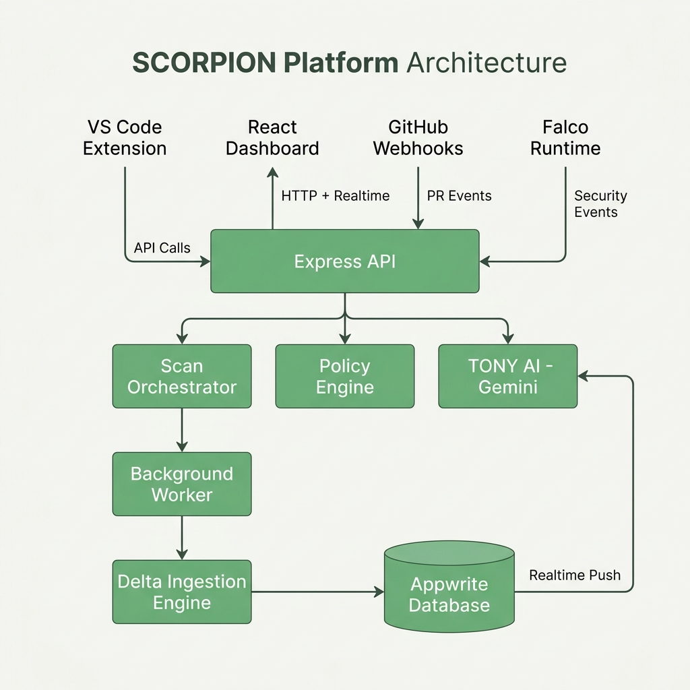
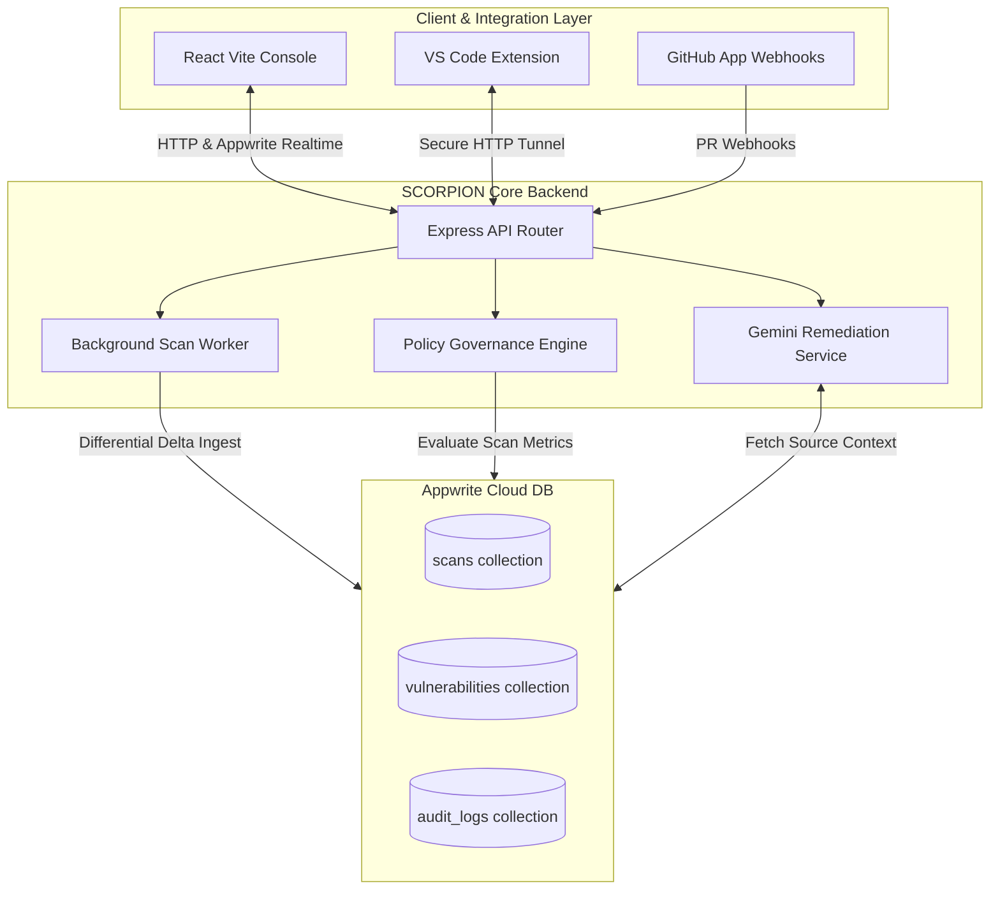
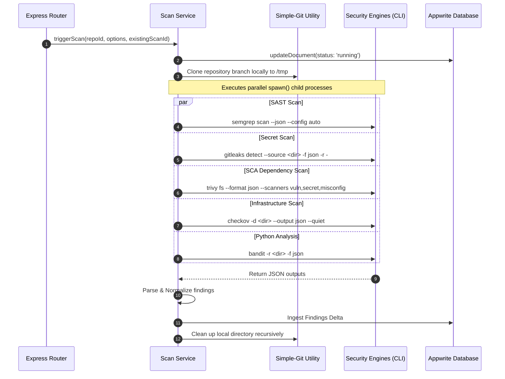
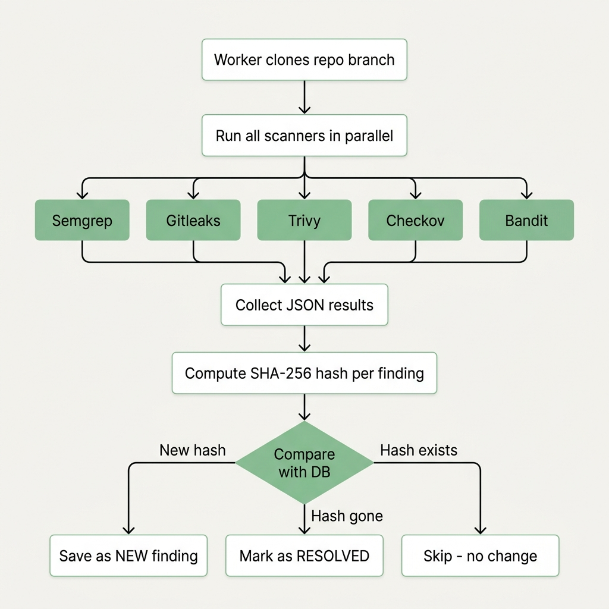
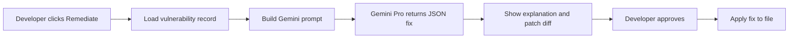
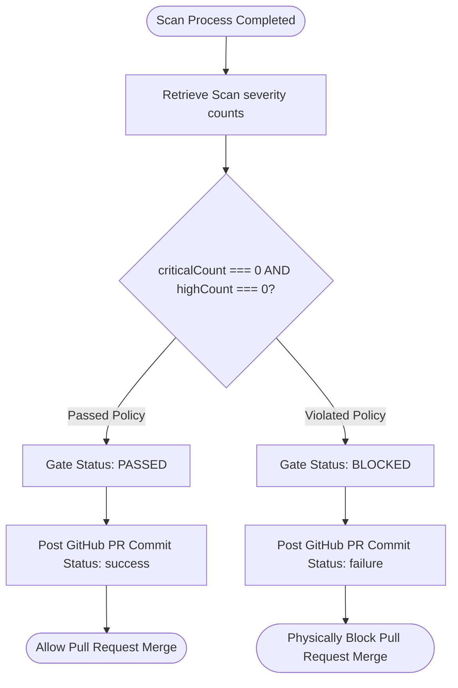
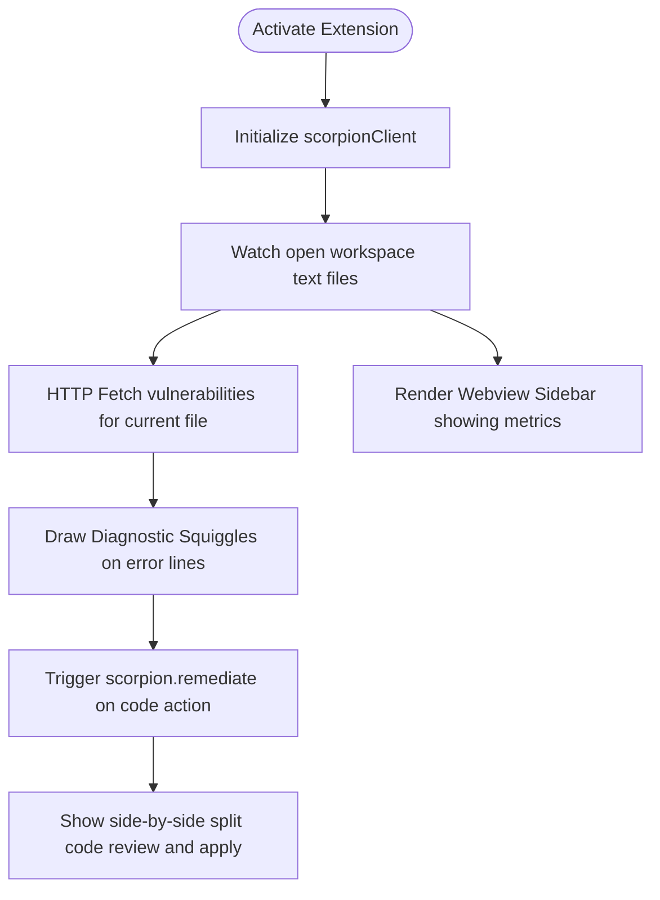
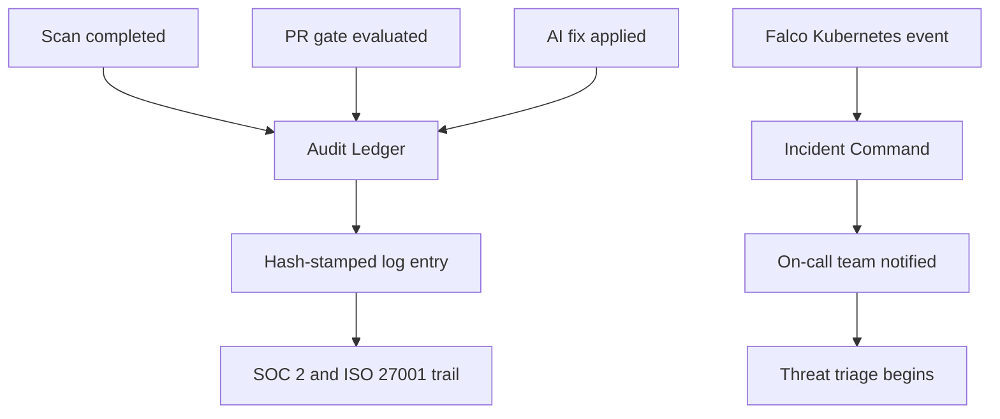

# 🛡️ SCORPION: Enterprise-Grade AI-Powered DevSecOps Orchestration Platform

SCORPION is an automated, production-grade security control plane that unifies multi-engine security scanning, real-time threat telemetry, policy-driven CI/CD gates, and Google Gemini-powered AI remediation into a closed-loop security posture platform. It protects applications across their entire lifecycle—from the developer's local VS Code sandbox to GitHub pull requests and production deployment runtimes.

---

## 🏛️ Platform Architecture



SCORPION is architected as a decentralized, multi-tiered security system composed of a React front-end dashboard, an Express API gateway, a background worker, and external integrations (GitHub App & VS Code Extension), all synchronized in real-time through an Appwrite Cloud telemetry database.



---

## 🏎️ Core Modules & System Workflows

---

### 1. Parallel Multi-Engine Scan Pipeline

When a scan is initiated (manually, via cron, or PR webhooks), the scan service clones the target repository and coordinates five specialized security scanners in parallel under a secure environment.

* **File Path**: [`backend/src/workers/scanWorker.ts`](file:///c:/Users/manik/OneDrive/Desktop/Scorpion/backend/src/workers/scanWorker.ts) & [`backend/src/services/scanService.ts`](file:///c:/Users/manik/OneDrive/Desktop/Scorpion/backend/src/services/scanService.ts)



---

### 2. Differential Delta Ingestion Logic

To ensure lightning-fast database writes and avoid duplicate alerts, SCORPION implements a differential delta scanning system. It computes unique SHA-256 fingerprints to compare current scan findings against stored issues.



* **File Path**: [`backend/src/services/scanService.ts#L22`](file:///c:/Users/manik/OneDrive/Desktop/Scorpion/backend/src/services/scanService.ts#L22) (Function: `ingestVulnerabilitiesDelta`)

```mermaid
flowchart TD
    Start([Receive Incoming Vulnerabilities]) --> FetchDB[Fetch Open Vulnerabilities from DB]
    
    FetchDB --> HashDB[Compute SHA-256 Hashing Signatures for DB docs]
    HashDB --> HashIncoming[Compute SHA-256 Hashing Signatures for incoming items]
    
    Note over HashDB, HashIncoming: Hash Format: repoId | filePath | cveId/Title | severity
    
    HashIncoming --> DiffCheck{In Incoming but NOT in DB?}
    DiffCheck -- Yes --> CreateDoc[createDocument: Insert new vulnerability status: 'open']
    DiffCheck -- No --> ActiveCheck{In DB but MISSING from Incoming?}
    
    ActiveCheck -- Yes --> ResolveDoc[updateDocument: Mark vulnerability status: 'resolved']
    ActiveCheck -- No --> Ignore[Keep current status unchanged]
```

---

### 3. TONY: Context-Aware AI Remediation Engine

Integrating directly with Google Gemini Pro, TONY generates instant context-aware drop-in source code patches and git-compliant patch diffs.

* **File Path**: [`backend/src/services/aiService.ts`](file:///c:/Users/manik/OneDrive/Desktop/Scorpion/backend/src/services/aiService.ts) & [`backend/src/routes/remediate.ts`](file:///c:/Users/manik/OneDrive/Desktop/Scorpion/backend/src/routes/remediate.ts)



---

### 4. GitHub PR Policy Enforcement Gate

The policy governance engine acts as a pipeline block, checking repository vulnerabilities against critical thresholds and posting results directly to GitHub's commit status checks API.

* **File Path**: [`backend/src/services/policyService.ts`](file:///c:/Users/manik/OneDrive/Desktop/Scorpion/backend/src/services/policyService.ts) & [`backend/src/github/policyEngine.ts`](file:///c:/Users/manik/OneDrive/Desktop/Scorpion/backend/src/github/policyEngine.ts)



---

### 5. VS Code Security Extension Workspace Loop

The VS Code Extension embeds centralized SCORPION intelligence directly into local developer environments.

* **File Path**: [`scorpion-vscode/src/diagnosticProvider.ts`](file:///c:/Users/manik/OneDrive/Desktop/Scorpion/scorpion-vscode/src/diagnosticProvider.ts) & [`scorpion-vscode/src/sidebarProvider.ts`](file:///c:/Users/manik/OneDrive/Desktop/Scorpion/scorpion-vscode/src/sidebarProvider.ts)



---

### 6. Audit Ledger & Incident Command Workspace

SCORPION ensures absolute traceability and real-time response for security posture violations across developer logs, compliance checks, and cloud runtime workloads.

* **File Path**: [`src/pages/AuditLedger.tsx`](file:///c:/Users/manik/OneDrive/Desktop/Scorpion/src/pages/AuditLedger.tsx) & [`src/pages/Teams.tsx`](file:///c:/Users/manik/OneDrive/Desktop/Scorpion/src/pages/Teams.tsx)



---

## 💻 Tech Stack & Dependencies

### Frontend Command Center

* **Core framework**: React `^18.3.1` (Vite `^8.0.12`, TypeScript `^5.5.3`)
* **Styling & Assets**: Tailwind CSS `^3.4.1`, Lucide React `^0.344.0`
* **Realtime Telemetry Database**: Appwrite SDK `^23.0.0`
* **Analytics & Graphs**: Recharts `^3.7.0`, React Markdown `^10.1.0`
* **AI Generative Integration**: `@google/generative-ai` `^0.24.1`

### Orchestration Backend

* **Core gateway**: Express `^4.18.2` (Node.js, TypeScript `^5.3.3`)
* **Integrations & Git**: Octokit `^5.0.5`, `@octokit/rest` `^22.0.1`, simple-git `^3.36.0`
* **Background Scheduling**: node-cron `^3.0.3`, bullmq `^5.70.1`, node-appwrite `^22.1.3`
* **Observability & Analytics**: prom-client `^15.1.3`, winston `^3.19.0`, `@opentelemetry/api` `^1.9.1`

---

## 🚀 Quickstart Guide

### 📦 Prerequisites

Install the SCORPION security scanners locally before launching the background workers:

```bash
# Automate local CLI installations (Semgrep, Trivy, Gitleaks, Checkov, Bandit)
npm run install
```

### 1. Configuration Setup

Create a `.env` file in the `backend/` directory:

```env
APPWRITE_ENDPOINT=https://cloud.appwrite.io/v1
APPWRITE_PROJECT_ID=your_project_id
APPWRITE_API_KEY=your_appwrite_api_key
APPWRITE_DATABASE_ID=scorpion_db
GEMINI_API_KEY=your_gemini_generative_key
GITHUB_APP_ID=your_github_app_id
GITHUB_PRIVATE_KEY=your_github_pem_key
```

### 2. Launch Backend Services

```bash
cd backend
npm install
npm run dev
```

### 3. Launch UI Console

```bash
# Return to workspace root
npm install
npm run dev
```

### 4. Run VS Code Workspace

```bash
cd scorpion-vscode
npm install
# Press F5 in VS Code to run in debug extension mode
```

---

## 🛡️ Security Principles & Hardening

* **DEP0190 Argument Sanitization**: All subprocess spawns in [`scanWorker.ts`](file:///c:/Users/manik/OneDrive/Desktop/Scorpion/backend/src/workers/scanWorker.ts) and [`orchestrator.ts`](file:///c:/Users/manik/OneDrive/Desktop/Scorpion/backend/src/services/scan/orchestrator.ts) run with arrays of arguments without shell interpretation (`shell: false`), completely eliminating argument injection.
* **Cryptographic Tamper-Proofing**: The Audit Ledger creates deterministic cryptographic hash checks for all scanner inputs, securing compliance trails from manual database alterations.
* **Least-Privilege RBAC**: Platform access is separated into Developer, Security Operator, and Admin roles managed by node-appwrite, enforcing zero-trust data retrieval.
