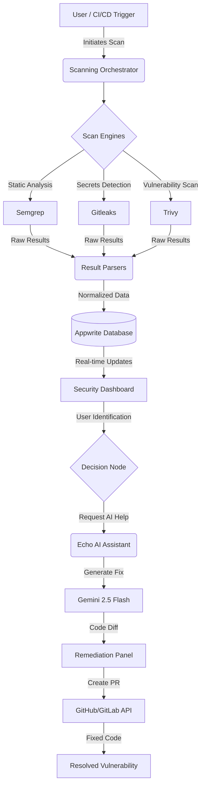

# 🛡️ SCORPION: Enterprise DevSecOps Orchestration Platform

SCORPION is a premium, end-to-end security orchestration platform (SOAR) designed to streamline vulnerability management, automate remediation, and enforce governance across the software development lifecycle (SDLC).

---

## 📊 System Architecture & Workflow

The following flowchart illustrates the lifecycle of a security finding in SCORPION, from initial detection to automated remediation.



---

## 🚀 Core Features & Functionality

### 1. Unified Security Dashboard
*   **Centralized Metrics**: Aggregates data from `Scans` and `Findings` into high-fidelity visualizations using **Recharts**.
*   **Risk Profiling**: Instant visibility into severity distributions (Critical, High, Medium, Low) and tool-specific performance.

### 2. Multi-Engine Scanning Orchestrator
*   **Parallel Execution**: Clones repositories and runs **Trivy**, **Semgrep**, and **Gitleaks** in parallel.
*   **Normalized Data**: Automatically parses heterogeneous tool outputs into a consistent vulnerability schema.

### 3. Echo: The AI DevSecOps Assistant
*   **Intelligent Chat**: A context-aware chatbot powered by **Gemini 2.5 Flash** that understands the platform's features and your specific scan data.
*   **Contextual Help**: Echo knows which page you're viewing (Reports, Governance, etc.) and provides tailored guidance.

### 4. Automated AI Remediation
*   **Self-Healing Code**: Generates precise code fixes for detected vulnerabilities with detailed explanations and confidence scores.
*   **One-Click PRs**: Instantly create Pull Requests for approved fixes directly via backend Git integrations.

### 5. Policy & Governance Management
*   **Governance-as-Code**: Define and enforce security policies across all projects to ensure compliance with organizational standards.
*   **Compliance Tracking**: Automated detection of non-compliant infrastructure and code.

### 6. Security Pulse & Alerts
*   **Discord Integration**: Real-time notifications for critical findings sent as rich embeds to your developer channels.
*   **Health Diagnostics**: Built-in monitoring suite for backend services, database connectivity, and scanner operational status.

---

## 🛠️ Technical Stack

| Component | Technology |
| :--- | :--- |
| **Frontend** | React 18, Vite, Tailwind CSS, Framer Motion |
| **Backend** | Node.js, Express, TypeScript |
| **Database & Auth** | Appwrite |
| **AI Engine** | Google Gemini 2.5 Flash |
| **Security Scanners** | Trivy, Semgrep, Gitleaks |

---

## 📜 Setup & Installation

### 1. Prerequisites
- **Node.js**: v18 or higher.
- **Appwrite**: Active project with API Keys and Database ID.
- **Gemini API Key**: For Echo AI features.

### 2. Installation
```bash
# Install frontend dependencies
npm install

# Install backend dependencies
cd backend
npm install
```

### 3. Running the App
**Frontend:** `npm run dev` (from root)  
**Backend:** `npm run dev` (from /backend)

---

## 📜 License
Distributed under the MIT License.
