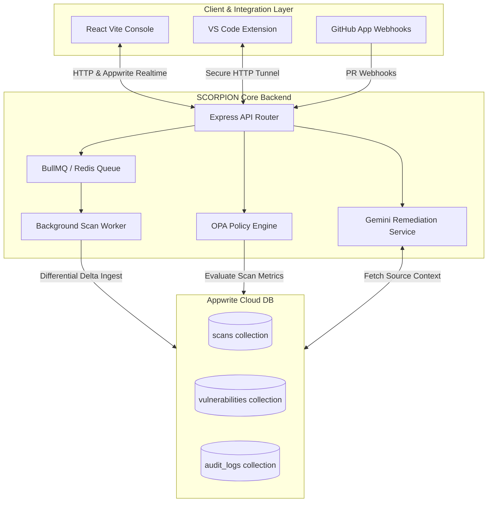
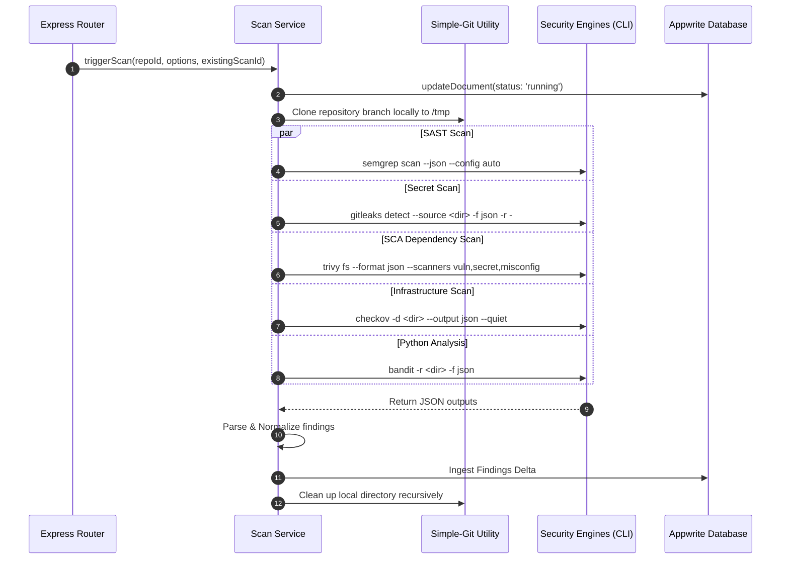
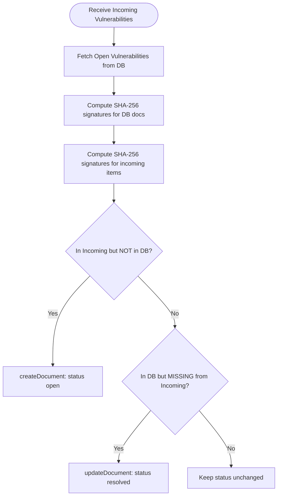
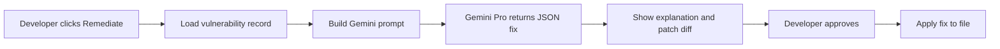
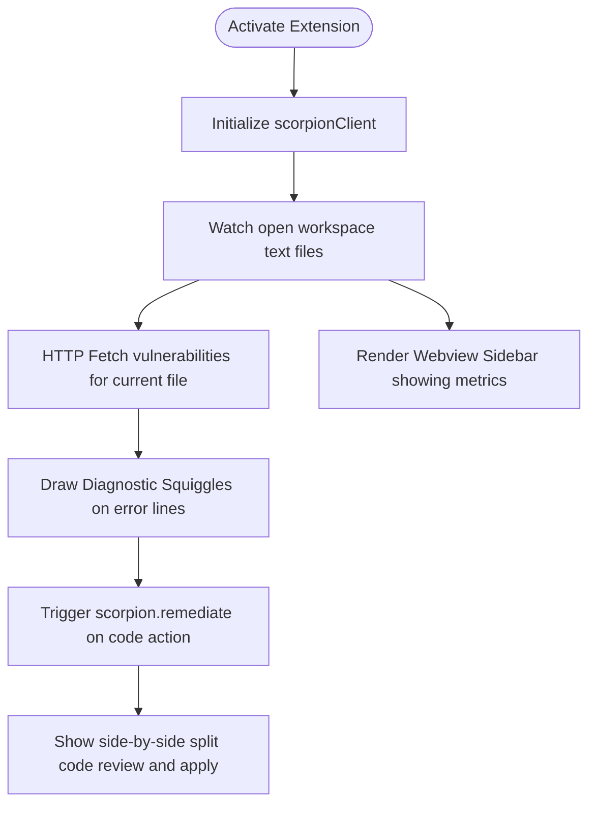
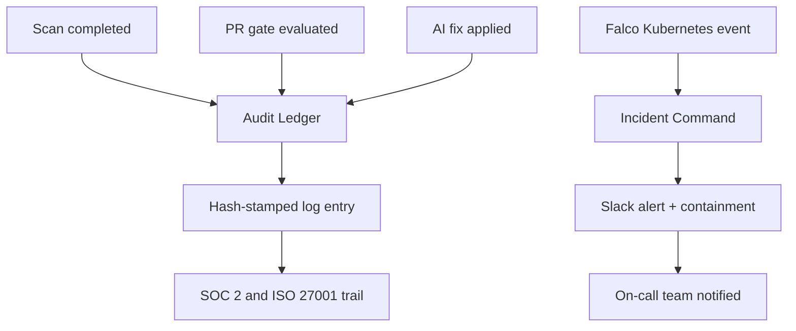
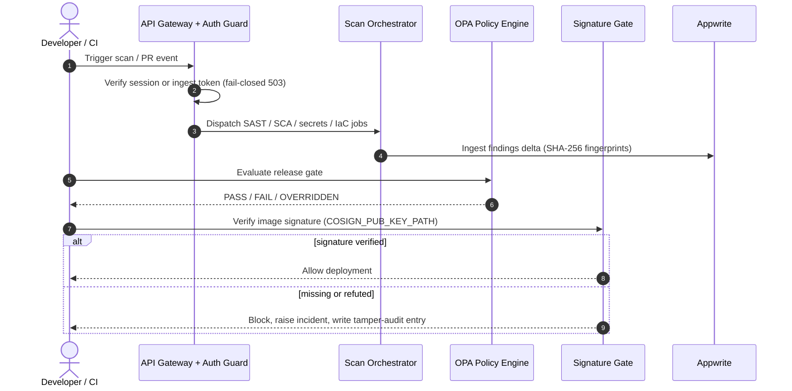

<div align="center">

```
   ██████  ██████ ██████  ██████  ██████  ██  ██████  ██████
   ██      ██     ██  ██  ██  ██  ██  ██  ██  ██  ██  ██  ██
   ██████  ██     ██  ██  ██████  ██████  ██  ██  ██  ██  ██
       ██  ██     ██  ██  ██  ██  ██      ██  ██  ██  ██  ██
   ██████  ██████ ██████  ██  ██  ██      ██  ██████  ██  ██
   ─────────────────────────────────────────────────────────
      DevSecOps orchestration · shift-left → runtime · 🦂
```

# 🛡️ SCORPION

**Multi-engine scanning · realtime threat telemetry · policy-gated CI/CD · AI remediation**

*From your VS Code buffer to the prod cluster — zero drift, no cap.*

[](https://github.com/Manikantareddy941-hash/Scorpion/actions/workflows/ci.yml)
[](https://github.com/Manikantareddy941-hash/Scorpion/actions/workflows/stackpilot-scan.yml)


</div>

---

## 📑 Table of Contents

- [⚡ TL;DR](#-tldr)
- [🛠️ Features](#️-features)
- [🏗️ Architecture](#️-architecture)
- [🔄 Core Workflows](#-core-workflows)
- [🧰 Tech Stack](#-tech-stack)
- [🚀 Quickstart](#-quickstart)
- [🛡️ Hardening Flex](#️-hardening-flex)
- [🧪 Verification & Gate High-Scores](#-verification--gate-high-scores)
- [📁 Project Structure](#-project-structure)
- [🤝 Contributing](#-contributing)

---

## ⚡ TL;DR

SCORPION is a production-grade security control plane that covers the whole lifecycle — local VS Code sandbox, GitHub pull requests, production runtime — behind one dashboard.

It runs **5 core engines** (SAST, SCA, secrets, IaC, Python) plus **3 dedicated DAST workers** in parallel, gates releases with **OPA/Rego policy-as-code**, and ships **Gemini**-generated patches as reviewable diffs.

Every release passes a **cosign signature gate**; every finding lands in a hash-stamped audit ledger. Nothing merges on vibes. 🔒

---

## 🛠️ Features

| Category | Capability | Vibe Check |
|---|---|---|
| 🔍 **Scanning** | Parallel SAST (Semgrep), SCA (Trivy), secrets (Gitleaks), IaC (Checkov), Python (Bandit) + DAST workers (OWASP ZAP, Nuclei, ffuf) | 8 engines, one verdict 🎯 |
| 🤖 **AI Remediation** | "TONY" engine — context-aware patches via **Gemini**, delivered as reviewable unified diffs | your vulns are cooked 🔥 |
| 🚪 **Policy Gates** | OPA/Rego authored in a Policy Builder UI, enforced at the GitHub PR commit-status gate **and** the Kubernetes deploy gate | policy-as-code, not policy-as-hope |
| 🏢 **Multi-Tenancy** | Team-scoped repos/scans/incidents, fine-grained IAM, Okta/Microsoft SSO via Appwrite OAuth2 | tenants stay in their lane |
| 🧵 **Async Pipeline** | Redis-backed BullMQ queue, fully decoupled from the request thread | non-blocking, zero stalls |
| 🧊 **Execution Isolation** | Ephemeral K8s Jobs under `--network none` (`RUNNER_MODE=kubernetes`), Docker + binary fallbacks, each announced via `RUNNER_MODE_SELECTED` | airgapped when it counts |
| 🧩 **Threat Modeling** | STRIDE modeling with Gemini threat generation → one-click convert to acceptance-criteria security stories | threats become tickets |
| 🔐 **Supply Chain** | cosign image signing + verification gate, provenance tracking, automated leaked-secret revocation | signed or it doesn't ship |
| 🚨 **Incident Response** | Slack alerting, automated containment, Falco runtime event ingestion | 3am pager, handled |
| 📋 **Compliance** | SOC 2 / ISO 27001 / HIPAA / GDPR control evaluation, hash-stamped audit ledger | auditors eat good |
| 🧰 **Dev Integrations** | VS Code extension with inline diagnostics, GitHub App webhooks | squiggles where you live |

---

## 🏗️ Architecture

Decentralized and multi-tiered: React dashboard, Express API gateway, background worker fleet, external integrations (GitHub App, VS Code extension) — all synchronized through an Appwrite Cloud telemetry database.

> 📐 Every diagram here is **native Mermaid**, not an exported PNG. That means it shows up in a pull-request diff and physically cannot drift from the system it describes without someone editing it. Zero drift, enforced by format.


```mermaid
flowchart TD
    subgraph ClientTier [Client & Integration Layer]
        FE[React Vite Console]
        VSCode[VS Code Extension]
        GHApp[GitHub App Webhooks]
    end

    subgraph CoreBackend [SCORPION Core Backend]
        API[Express API Router]
        Queue[BullMQ / Redis Queue]
        Worker[Background Scan Worker]
        Policy[OPA Policy Engine]
        AI[Gemini Remediation Service]
    end

    subgraph Storage [Appwrite Cloud DB]
        ScansColl[(scans collection)]
        VulnsColl[(vulnerabilities collection)]
        AuditColl[(audit_logs collection)]
    end

    FE <-->|HTTP & Appwrite Realtime| API
    VSCode <-->|Secure HTTP Tunnel| API
    GHApp -->|PR Webhooks| API

    API --> Queue --> Worker
    API --> Policy
    API --> AI

    Worker -->|Differential Delta Ingest| Storage
    Policy -->|Evaluate Scan Metrics| Storage
    AI <-->|Fetch Source Context| Storage
```

---

## 🔄 Core Workflows

<details>
<summary><b>1. ⚡ Parallel Multi-Engine Scan Pipeline</b></summary>

Scan service clones the target repo and runs five scanners in parallel under a sandboxed environment, queued via BullMQ.

**Files:** [`backend/src/workers/scanWorker.ts`](backend/src/workers/scanWorker.ts) · [`backend/src/services/scanService.ts`](backend/src/services/scanService.ts)


```mermaid
sequenceDiagram
    autonumber
    participant Router as Express Router
    participant Service as Scan Service
    participant Git as Simple-Git Utility
    participant Tools as Security Engines (CLI)
    participant DB as Appwrite Database

    Router->>Service: triggerScan(repoId, options, existingScanId)
    Service->>DB: updateDocument(status: 'running')
    Service->>Git: Clone repository branch locally to /tmp
    par SAST Scan
        Service->>Tools: semgrep scan --json --config auto
    and Secret Scan
        Service->>Tools: gitleaks detect --source <dir> -f json -r -
    and SCA Dependency Scan
        Service->>Tools: trivy fs --format json --scanners vuln,secret,misconfig
    and Infrastructure Scan
        Service->>Tools: checkov -d <dir> --output json --quiet
    and Python Analysis
        Service->>Tools: bandit -r <dir> -f json
    end
    Tools-->>Service: Return JSON outputs
    Service->>Service: Parse & Normalize findings
    Service->>DB: Ingest Findings Delta
    Service->>Git: Clean up local directory recursively
```
</details>

<details>
<summary><b>2. 🧬 Differential Delta Ingestion</b></summary>

SHA-256 fingerprints compare incoming findings against stored issues to avoid duplicate alerts and enable fast writes.

**File:** [`backend/src/services/scanService.ts#L22`](backend/src/services/scanService.ts) (`ingestVulnerabilitiesDelta`)


```mermaid
flowchart TD
    Start([Receive Incoming Vulnerabilities]) --> FetchDB[Fetch Open Vulnerabilities from DB]
    FetchDB --> HashDB[Compute SHA-256 signatures for DB docs]
    HashDB --> HashIncoming[Compute SHA-256 signatures for incoming items]
    HashIncoming --> DiffCheck{In Incoming but NOT in DB?}
    DiffCheck -- Yes --> CreateDoc[createDocument: status open]
    DiffCheck -- No --> ActiveCheck{In DB but MISSING from Incoming?}
    ActiveCheck -- Yes --> ResolveDoc[updateDocument: status resolved]
    ActiveCheck -- No --> Ignore[Keep status unchanged]
```
</details>

<details>
<summary><b>3. 🤖 TONY: AI Remediation Engine</b></summary>

Generates context-aware drop-in patches and git-compliant diffs via Gemini Pro.

**Files:** [`backend/src/services/aiService.ts`](backend/src/services/aiService.ts) · [`backend/src/routes/remediate.ts`](backend/src/routes/remediate.ts)


```mermaid
flowchart LR
    DeveloperRemediate["Developer clicks Remediate"] --> LoadRecord["Load vulnerability record"]
    LoadRecord --> BuildPrompt["Build Gemini prompt"]
    BuildPrompt --> GeminiReturn["Gemini Pro returns JSON fix"]
    GeminiReturn --> ShowExpl["Show explanation and patch diff"]
    ShowExpl --> DevApprove["Developer approves"]
    DevApprove --> ApplyFix["Apply fix to file"]
```
</details>

<details>
<summary><b>4. 🚪 GitHub PR Policy Enforcement Gate (OPA)</b></summary>

Checks repo vulnerabilities against OPA/Rego policy and posts results to GitHub commit status checks.

**Files:** [`backend/src/services/opaService.ts`](backend/src/services/opaService.ts) · [`backend/src/services/policyService.ts`](backend/src/services/policyService.ts) · [`backend/src/github/policyEngine.ts`](backend/src/github/policyEngine.ts)


```mermaid
flowchart TD
    ScanEnd([Scan Process Completed]) --> PullScan[Retrieve Scan severity counts]
    PullScan --> CheckRule{OPA policy evaluation}
    CheckRule -- Passed --> PassState[Gate Status: PASSED]
    CheckRule -- Violated --> FailState[Gate Status: BLOCKED]
    PassState --> PostPass[Post GitHub PR Commit Status: success]
    FailState --> PostFail[Post GitHub PR Commit Status: failure]
    PostPass --> MergeOK([Allow Pull Request Merge])
    PostFail --> MergeBlocked([Block Pull Request Merge])
```
</details>

<details>
<summary><b>5. 🧰 VS Code Extension Workspace Loop</b></summary>

Embeds SCORPION intelligence directly into the local dev environment.

**Files:** [`scorpion-vscode/src/diagnosticProvider.ts`](scorpion-vscode/src/diagnosticProvider.ts) · [`scorpion-vscode/src/sidebarProvider.ts`](scorpion-vscode/src/sidebarProvider.ts)


```mermaid
flowchart TD
    VSActivate([Activate Extension]) --> Connect[Initialize scorpionClient]
    Connect --> Watch[Watch open workspace text files]
    Watch --> FetchVulns[HTTP Fetch vulnerabilities for current file]
    FetchVulns --> SetSquiggles[Draw Diagnostic Squiggles on error lines]
    Watch --> SidebarPanel[Render Webview Sidebar showing metrics]
    SetSquiggles --> RemediateCmd[Trigger scorpion.remediate on code action]
    RemediateCmd --> DiffView[Show side-by-side split code review and apply]
```
</details>

<details>
<summary><b>6. 🏢 Multi-Tenancy, Threat Modeling & Incident Response</b></summary>

Repos/scans/incidents/compliance are team-scoped (closing cross-tenant IDOR); STRIDE threat modeling generates threats with Gemini AI and converts them into acceptance-criteria security stories; critical incidents trigger Slack alerts and automated containment, feeding the hash-stamped Audit Ledger.

**Files:** [`backend/src/services/tenancyService.ts`](backend/src/services/tenancyService.ts) · [`backend/src/services/threatModelService.ts`](backend/src/services/threatModelService.ts) · [`backend/src/services/slackService.ts`](backend/src/services/slackService.ts) · [`src/pages/AuditLedger.tsx`](src/pages/AuditLedger.tsx)


```mermaid
flowchart TD
    ScanCompleted["Scan completed"] --> AuditLedger["Audit Ledger"]
    PRGate["PR gate evaluated"] --> AuditLedger
    AIFix["AI fix applied"] --> AuditLedger
    AuditLedger --> HashStamped["Hash-stamped log entry"]
    HashStamped --> SOCTrail["SOC 2 and ISO 27001 trail"]

    FalcoEvent["Falco Kubernetes event"] --> IncidentCommand["Incident Command"]
    IncidentCommand --> SlackAlert["Slack alert + containment"]
    SlackAlert --> OnCallTeam["On-call team notified"]
```
</details>

<details>
<summary><b>7. 🔐 Release Gate Flow — auth → scan → policy → signature</b></summary>


```mermaid
sequenceDiagram
    autonumber
    actor Dev as Developer / CI
    participant Gate as API Gateway + Auth Guard
    participant Scanner as Scan Orchestrator
    participant OPA as OPA Policy Engine
    participant Cosign as Signature Gate
    participant DB as Appwrite

    Dev->>Gate: Trigger scan / PR event
    Gate->>Gate: Verify session or ingest token (fail-closed 503)
    Gate->>Scanner: Dispatch SAST / SCA / secrets / IaC jobs
    Scanner->>DB: Ingest findings delta (SHA-256 fingerprints)

    Dev->>OPA: Evaluate release gate
    OPA-->>Dev: PASS / FAIL / OVERRIDDEN

    Dev->>Cosign: Verify image signature (COSIGN_PUB_KEY_PATH)
    alt signature verified
        Cosign-->>Dev: Allow deployment
    else missing or refuted
        Cosign-->>Dev: Block, raise incident, write tamper-audit entry
    end
```

> ⚠️ **Ordering is load-bearing.** The signature gate is inert unless `REQUIRE_IMAGE_SIGNATURE` **and** `COSIGN_PUB_KEY_PATH` are both configured — and enabling the former **without** the latter blocks *every* production deploy. Full sequence in [OPERATIONS_RUNBOOK.md](./OPERATIONS_RUNBOOK.md); `probeSigningReadiness` catches the mistake at boot instead of mid-release.

</details>

---

## 🧰 Tech Stack

<table>
<tr><td valign="top">

**🎨 Frontend**
- React `19` · Vite `8` · TypeScript `6`
- Tailwind CSS · Lucide React
- Appwrite SDK (realtime)
- Recharts · amCharts 5 · React Markdown · React Flow
- `@google/generative-ai`

</td><td valign="top">

**⚙️ Backend**
- Express · TypeScript `6` · Node.js `24`
- BullMQ + ioredis · Prisma (Postgres / SQLite adapters)
- Octokit / `@octokit/auth-app` · simple-git · dockerode
- zod · helmet · express-rate-limit · bcrypt · jsonwebtoken
- Resend (email) · pdfkit · json2csv · archiver
- winston + winston-loki · prom-client · OpenTelemetry
- cosign CLI · OPA (Rego)

</td></tr>
</table>

> 🧠 **Gemini only.** `openai` was purged in #268 — it was a dead dependency constructing a client nothing ever called. Both AI paths hit Gemini over `fetch`.

---

## 🚀 Quickstart

### 0️⃣ Prereqs

```bash
# Installs Semgrep, Trivy, Gitleaks, Checkov, Bandit
npm run install
```

### 1️⃣ Configure env

Create `backend/.env`:

```env
APPWRITE_ENDPOINT=https://cloud.appwrite.io/v1
APPWRITE_PROJECT_ID=your_project_id
APPWRITE_API_KEY=your_appwrite_api_key
APPWRITE_DATABASE_ID=scorpion_db
GEMINI_API_KEY=your_gemini_generative_key
GITHUB_APP_ID=your_github_app_id
GITHUB_PRIVATE_KEY=your_github_pem_key
```

<details>
<summary><b>🔐 Optional: signing, enforcement & isolation</b></summary>

```env
COSIGN_PUB_KEY_PATH=/keys/cosign.pub   # verification — set this FIRST
COSIGN_KEY_PATH=/keys/cosign.key       # backend-side signing
COSIGN_PASSWORD=...                    # read by the cosign binary, not by our code
REQUIRE_IMAGE_SIGNATURE=true           # ONLY after COSIGN_PUB_KEY_PATH is live
RUNNER_MODE=kubernetes                 # the only isolated mode; never auto-selected
```

Order matters, and getting it wrong is loud: see [OPERATIONS_RUNBOOK.md](./OPERATIONS_RUNBOOK.md).

</details>

### 2️⃣ Backend

```bash
cd backend
npm install
npm run dev
```

### 3️⃣ Dashboard

```bash
npm install
npm run dev
```

### 4️⃣ VS Code extension

```bash
cd scorpion-vscode
npm install
# smash F5 to launch the debug extension host
```

---

## 🛡️ Hardening Flex

The 10 rules keeping prod untouchable — every one verified against `main`, not vibed:

| # | Rule | Mechanism |
|---|---|---|
| 1️⃣ | **No shell interpolation** | Every subprocess goes through `execFile` with an **argv array** across 20 modules. No shell is ever spawned, so there's nothing to inject into. |
| 2️⃣ | **Outbound SSRF blocked** | `assertSafeWebhookUrl` guards alert webhooks **and** the Jira integration's user-supplied `baseUrl` — checked inside the request helper, not at config time, because config is mutable at runtime. |
| 3️⃣ | **Telemetry auth, fail-closed** | `/api/metrics` + `/api/logs` require an ingest token **or** a session, and the repo is checked against the identity the *credential* carries — never the body's `repoId`. Access check throws → **503**, never a pass-through. |
| 4️⃣ | **Email verification gate** | CI tokens, team invites, alert integrations and report export require `emailVerification === true` → `403 { code: 'EMAIL_VERIFICATION_REQUIRED' }`. Soft, not hard: an SMTP-less self-host *cannot* verify, so the dashboard stays open. |
| 5️⃣ | **Dev bypass is opt-in** | `ALLOW_DEV_AUTH_BYPASS`, and it **hard-refuses in `NODE_ENV=production`**. |
| 6️⃣ | **Tenant isolation** | Repos, scans, vulns, builds, deployments, incidents, compliance and policy entities are team-scoped; IDOR closed across multiple hardening passes. |
| 7️⃣ | **Request hardening** | Baseline + endpoint-specific rate limiting, correct `trust proxy`, HSTS, structured auth logging, Zod validation on high-risk writes. |
| 8️⃣ | **Upload defense** | Validated by **content**, not extension, with zip-bomb guards. |
| 9️⃣ | **Supply chain** | cosign signing + a verification gate that blocks, raises an incident and writes a tamper-audit entry; release gates evaluated via OPA/Rego, not hardcoded thresholds. |
| 🔟 | **Tamper-proof audit** | Deterministic cryptographic hashing on all scanner inputs feeding the Audit Ledger. |

---

## 🧪 Verification & Gate High-Scores

```bash
cd backend && npm test          # 187 suites · 1763 green · 98 skipped
cd backend && npx tsc --noEmit
npm test                        # frontend: 7 files · 51 tests
npm run typecheck
```

### 📊 Scoreboard

| Metric | Score | Status |
|---|---|---|
| 🧪 Backend suites | **187 / 187** | ✅ |
| ✅ Backend tests | **1,763 green** · 98 skipped | ✅ |
| 🎨 Frontend | 7 files · **51 green** · Playwright **10** | ✅ |
| 🔷 TypeScript | **0 errors**, both trees | ✅ |
| 🚨 Prod advisories | **0** high/critical, both trees | ✅ |

> 💡 The **12 skipped backend suites are DB integration tests**, gated behind `RUN_DB_IT` + Docker. Skipping is *by design* — not a gap, not a TODO.

### 🔒 The Four Gates

| Gate | Value | Direction |
|---|---|---|
| `auditLoggerCalls.js` | `--max=0` | **Regression guard.** 0 is the destination — convert the call site, never raise the number. |
| `auditResponseErrorLeaks.js` | `--max=31 --min=31` | **Bounded both ways.** ⚠️ The floor is *structural*: 19 authorization + 12 validation messages the caller is entitled to. The tool can't tell those from an Appwrite error (all three are `.message`). Sweeping it to 0 breaks real clients **while making a security tool report success.** Do not touch. |
| backend ESLint | `--max-warnings=168` | Ratchet — lowers only. |
| frontend ESLint | `--max-warnings=23` | Ratchet — **zero headroom**. One new warning fails CI. |
| `npm audit --omit=dev` | `--audit-level=high` | Zero tolerance, both trees. |

---

## 📁 Project Structure

```
Scorpion/
├── backend/            Express API, workers, scanners, services
├── src/                React dashboard (Vite + TypeScript)
├── scorpion-vscode/    VS Code extension
├── functions/          Appwrite serverless functions (e.g. trivy-scanner)
├── public/             Static assets
├── docs/               ADRs + additional documentation
└── scripts/            Tooling install scripts
```

📕 Operational config — cosign tiers, runner isolation, provenance migration — lives in **[OPERATIONS_RUNBOOK.md](./OPERATIONS_RUNBOOK.md)**.
🧠 Repo conventions and the traps that have cost us time live in **[CLAUDE.md](./CLAUDE.md)**.

---

## 🤝 Contributing

Issues and PRs welcome. Run the gauntlet before you send it:

```bash
npm run lint && npm run typecheck && npm test
```

Green across the board or it doesn't ship. 🚦
