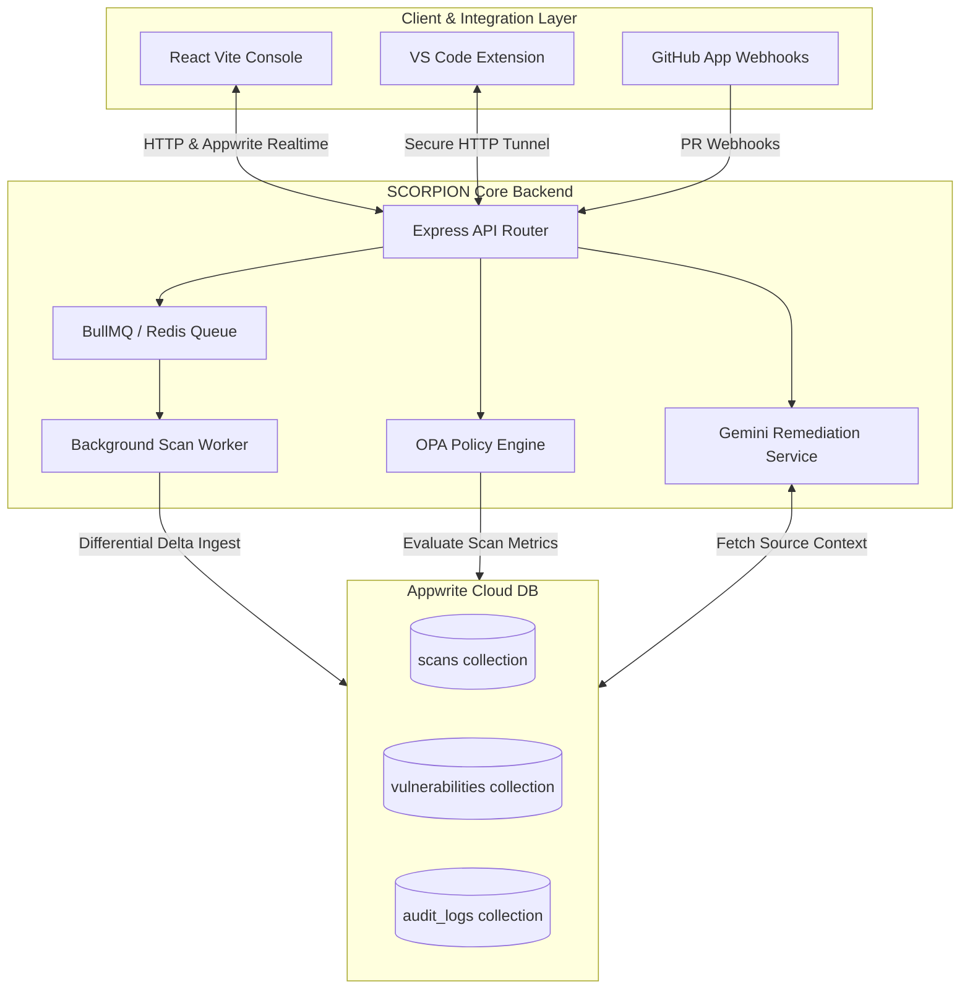
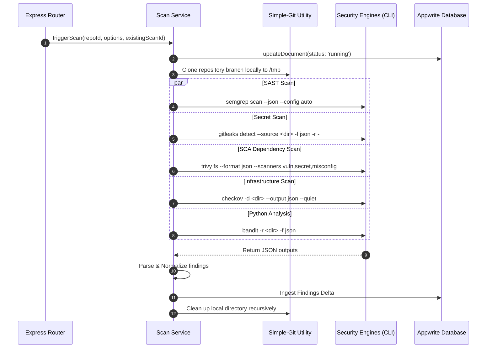
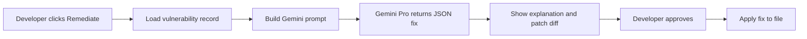
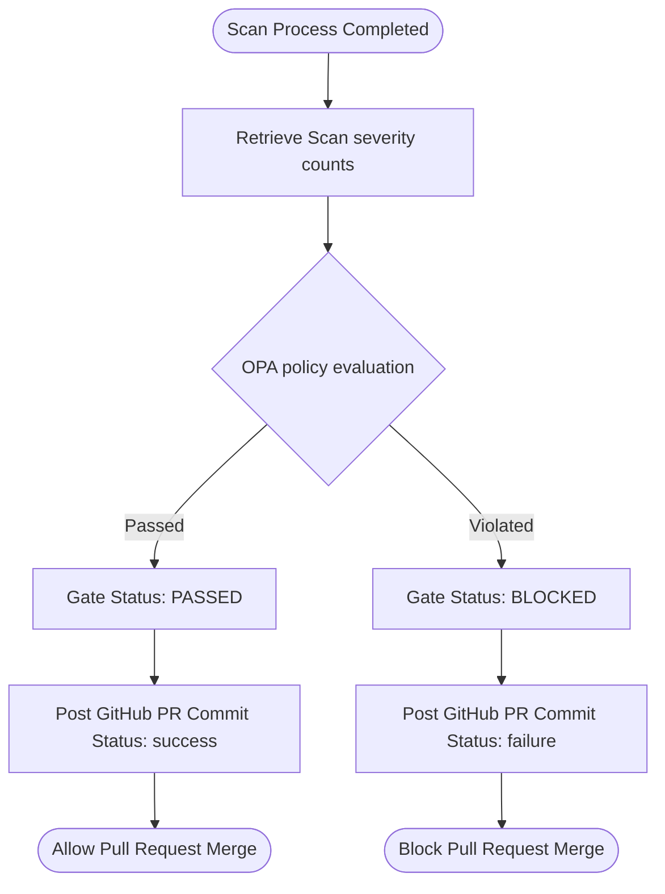
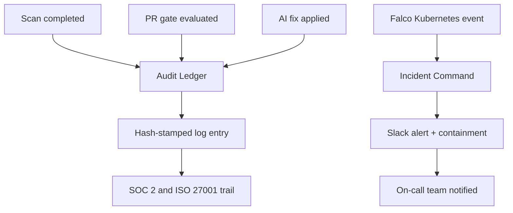
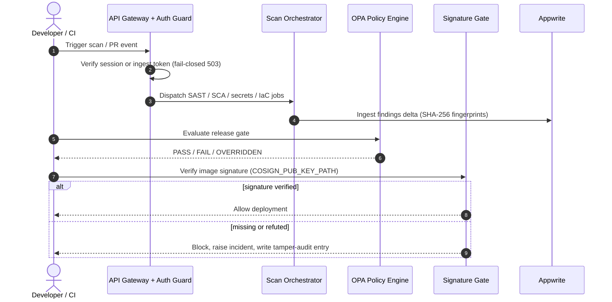

<div align="center">


### 🦂 Multi-engine scanning · realtime threat telemetry · policy-gated CI/CD · AI remediation

**From your VS Code buffer to the prod cluster — zero drift, no cap.**

<br/>

[](#-quickstart)
[](#️-architecture)
[](#️-hardening-flex)
[](./OPERATIONS_RUNBOOK.md)

<br/>

<!-- ── build & quality ── -->
[](https://github.com/Manikantareddy941-hash/Scorpion/actions/workflows/ci.yml)
[](https://github.com/Manikantareddy941-hash/Scorpion/actions/workflows/stackpilot-scan.yml)
[](#-verification--gate-high-scores)
[](#-verification--gate-high-scores)

<!-- ── stack ── -->
[](#-tech-stack)
[](#-tech-stack)
[](#-tech-stack)
[](#-tech-stack)
[](#️-hardening-flex)
[](#-core-workflows)

</div>

---

> [!NOTE]
> **TL;DR** — SCORPION is a production-grade security control plane covering the whole lifecycle: local VS Code sandbox → GitHub pull requests → production runtime, behind one dashboard.
>
> It runs **5 core engines** (SAST · SCA · secrets · IaC · Python) plus **3 dedicated DAST workers** in parallel, gates releases with **OPA/Rego policy-as-code**, and ships **Gemini**-generated patches as reviewable diffs.
>
> Every release passes a **cosign signature gate**; every finding lands in a hash-stamped audit ledger. Nothing merges on vibes. 🔒

---

## 📑 Contents

| | | |
|---|---|---|
| ⚡ [Differentiators](#-differentiators) | 🛠️ [Features](#️-features) | 🏗️ [Architecture](#️-architecture) |
| 🔄 [Core Workflows](#-core-workflows) | 🧰 [Tech Stack](#-tech-stack) | 🚀 [Quickstart](#-quickstart) |
| 🛡️ [Hardening Flex](#️-hardening-flex) | 🧪 [Verification](#-verification--gate-high-scores) | 📁 [Structure](#-project-structure) |

---

## ⚡ Differentiators

> [!IMPORTANT]
> **What actually separates this from a scanner wrapper:**
>
> 🧊 **Real execution isolation** — `RUNNER_MODE=kubernetes` runs scanners as ephemeral Jobs under `--network none`. It is the **only** isolated mode and is **never auto-selected**, so every boot emits `RUNNER_MODE_SELECTED` with an `isolated` field to make silent fallback alertable.
>
> 🔐 **A signature gate that actually blocks** — refuted or missing provenance blocks the deploy, raises an incident, **and** writes a tamper-audit entry. Not a warning log.
>
> 🚪 **Policy-as-code, not hardcoded thresholds** — OPA/Rego authored in a Policy Builder UI, enforced at *both* the GitHub PR commit-status gate and the Kubernetes deploy gate.
>
> 🧬 **Differential ingestion** — SHA-256 fingerprints diff incoming findings against stored issues, so repeat scans don't spam duplicates.

---

## 🛠️ Features

| Category | Capability | Status |
|:---|:---|:---:|
| 🔍 **Scanning** | Parallel SAST `semgrep` · SCA `trivy` · secrets `gitleaks` · IaC `checkov` · Python `bandit` + DAST workers `ZAP` `nuclei` `ffuf` | ⚡ `ACTIVE` |
| 🤖 **AI Remediation** | "TONY" engine — context-aware patches via **Gemini**, delivered as reviewable unified diffs | ⚡ `ACTIVE` |
| 🚪 **Policy Gates** | `OPA/Rego` enforced at the GitHub PR commit-status gate **and** the Kubernetes deploy gate | 🔒 `ENFORCED` |
| 🧊 **Execution Isolation** | Ephemeral K8s Jobs under `--network none`, Docker + binary fallbacks, each announced via `RUNNER_MODE_SELECTED` | 🔒 `ENFORCED` |
| 🏢 **Multi-Tenancy** | Team-scoped repos/scans/incidents, fine-grained IAM, Okta/Microsoft SSO via Appwrite OAuth2 | 🔒 `ENFORCED` |
| 🧵 **Async Pipeline** | Redis-backed `BullMQ` queue, fully decoupled from the request thread | ⚡ `ACTIVE` |
| 🧩 **Threat Modeling** | STRIDE modeling with Gemini threat generation → one-click convert to security stories | ⚡ `ACTIVE` |
| 🔐 **Supply Chain** | `cosign` signing + verification gate, provenance tracking, automated leaked-secret revocation | 🔒 `ENFORCED` |
| 🚨 **Incident Response** | Slack alerting, automated containment, Falco runtime event ingestion | ⚡ `ACTIVE` |
| 📋 **Compliance** | SOC 2 / ISO 27001 / HIPAA / GDPR control evaluation, hash-stamped audit ledger | 🟢 `PASS` |
| 🧰 **Dev Integrations** | VS Code extension with inline diagnostics, GitHub App webhooks | ⚡ `ACTIVE` |

---

## 🏗️ Architecture

Decentralized and multi-tiered: React dashboard, Express API gateway, background worker fleet, external integrations (GitHub App, VS Code extension) — all synchronized through an Appwrite Cloud telemetry database.

> [!TIP]
> Every diagram below is **native Mermaid**, not an exported PNG. It shows up in a pull-request diff and physically cannot drift from the system it describes without someone editing it. **Zero drift, enforced by format.**


```mermaid
flowchart TD
    subgraph ClientTier [Client & Integration Layer]
        FE[React Vite Console]
        VSCode[VS Code Extension]
        GHApp[GitHub App Webhooks]
    end

    subgraph CoreBackend [SCORPION Core Backend]
        API[Express API Router]
        Queue[BullMQ / Redis Queue]
        Worker[Background Scan Worker]
        Policy[OPA Policy Engine]
        AI[Gemini Remediation Service]
    end

    subgraph Storage [Appwrite Cloud DB]
        ScansColl[(scans collection)]
        VulnsColl[(vulnerabilities collection)]
        AuditColl[(audit_logs collection)]
    end

    FE <-->|HTTP & Appwrite Realtime| API
    VSCode <-->|Secure HTTP Tunnel| API
    GHApp -->|PR Webhooks| API

    API --> Queue --> Worker
    API --> Policy
    API --> AI

    Worker -->|Differential Delta Ingest| Storage
    Policy -->|Evaluate Scan Metrics| Storage
    AI <-->|Fetch Source Context| Storage
```

---

## 🔄 Core Workflows

<details>
<summary><b>⚡ 1 · Parallel Multi-Engine Scan Pipeline</b></summary>
<br/>

Scan service clones the target repo and runs five scanners in parallel under a sandboxed environment, queued via BullMQ.

**Files:** [`backend/src/workers/scanWorker.ts`](backend/src/workers/scanWorker.ts) · [`backend/src/services/scanService.ts`](backend/src/services/scanService.ts)


```mermaid
sequenceDiagram
    autonumber
    participant Router as Express Router
    participant Service as Scan Service
    participant Git as Simple-Git Utility
    participant Tools as Security Engines (CLI)
    participant DB as Appwrite Database

    Router->>Service: triggerScan(repoId, options, existingScanId)
    Service->>DB: updateDocument(status: 'running')
    Service->>Git: Clone repository branch locally to /tmp
    par SAST Scan
        Service->>Tools: semgrep scan --json --config auto
    and Secret Scan
        Service->>Tools: gitleaks detect --source <dir> -f json -r -
    and SCA Dependency Scan
        Service->>Tools: trivy fs --format json --scanners vuln,secret,misconfig
    and Infrastructure Scan
        Service->>Tools: checkov -d <dir> --output json --quiet
    and Python Analysis
        Service->>Tools: bandit -r <dir> -f json
    end
    Tools-->>Service: Return JSON outputs
    Service->>Service: Parse & Normalize findings
    Service->>DB: Ingest Findings Delta
    Service->>Git: Clean up local directory recursively
```
</details>

<details>
<summary><b>🧬 2 · Differential Delta Ingestion</b></summary>
<br/>

SHA-256 fingerprints compare incoming findings against stored issues to avoid duplicate alerts and enable fast writes.

**File:** [`backend/src/services/scanService.ts#L22`](backend/src/services/scanService.ts) (`ingestVulnerabilitiesDelta`)


```mermaid
flowchart TD
    Start([Receive Incoming Vulnerabilities]) --> FetchDB[Fetch Open Vulnerabilities from DB]
    FetchDB --> HashDB[Compute SHA-256 signatures for DB docs]
    HashDB --> HashIncoming[Compute SHA-256 signatures for incoming items]
    HashIncoming --> DiffCheck{In Incoming but NOT in DB?}
    DiffCheck -- Yes --> CreateDoc[createDocument: status open]
    DiffCheck -- No --> ActiveCheck{In DB but MISSING from Incoming?}
    ActiveCheck -- Yes --> ResolveDoc[updateDocument: status resolved]
    ActiveCheck -- No --> Ignore[Keep status unchanged]
```
</details>

<details>
<summary><b>🤖 3 · TONY — AI Remediation Engine</b></summary>
<br/>

Generates context-aware drop-in patches and git-compliant diffs via Gemini Pro.

**Files:** [`backend/src/services/aiService.ts`](backend/src/services/aiService.ts) · [`backend/src/routes/remediate.ts`](backend/src/routes/remediate.ts)


```mermaid
flowchart LR
    DeveloperRemediate["Developer clicks Remediate"] --> LoadRecord["Load vulnerability record"]
    LoadRecord --> BuildPrompt["Build Gemini prompt"]
    BuildPrompt --> GeminiReturn["Gemini Pro returns JSON fix"]
    GeminiReturn --> ShowExpl["Show explanation and patch diff"]
    ShowExpl --> DevApprove["Developer approves"]
    DevApprove --> ApplyFix["Apply fix to file"]
```
</details>

<details>
<summary><b>🚪 4 · GitHub PR Policy Enforcement Gate (OPA)</b></summary>
<br/>

Checks repo vulnerabilities against OPA/Rego policy and posts results to GitHub commit status checks.

**Files:** [`backend/src/services/opaService.ts`](backend/src/services/opaService.ts) · [`backend/src/services/policyService.ts`](backend/src/services/policyService.ts) · [`backend/src/github/policyEngine.ts`](backend/src/github/policyEngine.ts)


```mermaid
flowchart TD
    ScanEnd([Scan Process Completed]) --> PullScan[Retrieve Scan severity counts]
    PullScan --> CheckRule{OPA policy evaluation}
    CheckRule -- Passed --> PassState[Gate Status: PASSED]
    CheckRule -- Violated --> FailState[Gate Status: BLOCKED]
    PassState --> PostPass[Post GitHub PR Commit Status: success]
    FailState --> PostFail[Post GitHub PR Commit Status: failure]
    PostPass --> MergeOK([Allow Pull Request Merge])
    PostFail --> MergeBlocked([Block Pull Request Merge])
```
</details>

<details>
<summary><b>🧰 5 · VS Code Extension Workspace Loop</b></summary>
<br/>

Embeds SCORPION intelligence directly into the local dev environment.

**Files:** [`scorpion-vscode/src/diagnosticProvider.ts`](scorpion-vscode/src/diagnosticProvider.ts) · [`scorpion-vscode/src/sidebarProvider.ts`](scorpion-vscode/src/sidebarProvider.ts)


```mermaid
flowchart TD
    VSActivate([Activate Extension]) --> Connect[Initialize scorpionClient]
    Connect --> Watch[Watch open workspace text files]
    Watch --> FetchVulns[HTTP Fetch vulnerabilities for current file]
    FetchVulns --> SetSquiggles[Draw Diagnostic Squiggles on error lines]
    Watch --> SidebarPanel[Render Webview Sidebar showing metrics]
    SetSquiggles --> RemediateCmd[Trigger scorpion.remediate on code action]
    RemediateCmd --> DiffView[Show side-by-side split code review and apply]
```
</details>

<details>
<summary><b>🏢 6 · Multi-Tenancy, Threat Modeling & Incident Response</b></summary>
<br/>

Repos/scans/incidents/compliance are team-scoped (closing cross-tenant IDOR); STRIDE threat modeling generates threats with Gemini AI and converts them into acceptance-criteria security stories; critical incidents trigger Slack alerts and automated containment, feeding the hash-stamped Audit Ledger.

**Files:** [`backend/src/services/tenancyService.ts`](backend/src/services/tenancyService.ts) · [`backend/src/services/threatModelService.ts`](backend/src/services/threatModelService.ts) · [`backend/src/services/slackService.ts`](backend/src/services/slackService.ts) · [`src/pages/AuditLedger.tsx`](src/pages/AuditLedger.tsx)


```mermaid
flowchart TD
    ScanCompleted["Scan completed"] --> AuditLedger["Audit Ledger"]
    PRGate["PR gate evaluated"] --> AuditLedger
    AIFix["AI fix applied"] --> AuditLedger
    AuditLedger --> HashStamped["Hash-stamped log entry"]
    HashStamped --> SOCTrail["SOC 2 and ISO 27001 trail"]

    FalcoEvent["Falco Kubernetes event"] --> IncidentCommand["Incident Command"]
    IncidentCommand --> SlackAlert["Slack alert + containment"]
    SlackAlert --> OnCallTeam["On-call team notified"]
```
</details>

<details>
<summary><b>🔐 7 · Release Gate Flow — auth → scan → policy → signature</b></summary>
<br/>


```mermaid
sequenceDiagram
    autonumber
    actor Dev as Developer / CI
    participant Gate as API Gateway + Auth Guard
    participant Scanner as Scan Orchestrator
    participant OPA as OPA Policy Engine
    participant Cosign as Signature Gate
    participant DB as Appwrite

    Dev->>Gate: Trigger scan / PR event
    Gate->>Gate: Verify session or ingest token (fail-closed 503)
    Gate->>Scanner: Dispatch SAST / SCA / secrets / IaC jobs
    Scanner->>DB: Ingest findings delta (SHA-256 fingerprints)

    Dev->>OPA: Evaluate release gate
    OPA-->>Dev: PASS / FAIL / OVERRIDDEN

    Dev->>Cosign: Verify image signature (COSIGN_PUB_KEY_PATH)
    alt signature verified
        Cosign-->>Dev: Allow deployment
    else missing or refuted
        Cosign-->>Dev: Block, raise incident, write tamper-audit entry
    end
```

> [!WARNING]
> **Ordering is load-bearing.** The signature gate is inert unless `REQUIRE_IMAGE_SIGNATURE` **and** `COSIGN_PUB_KEY_PATH` are both configured — and enabling the former **without** the latter blocks *every* production deploy. Full sequence in [OPERATIONS_RUNBOOK.md](./OPERATIONS_RUNBOOK.md); `probeSigningReadiness` catches the mistake at boot instead of mid-release.

</details>

---

## 🧰 Tech Stack

<table>
<tr>
<td valign="top" width="50%">

### 🎨 Frontend

| | |
|---|---|
| Framework | `React 19.2.8` · `Vite 8` |
| Language | `TypeScript 6.0.3` |
| Styling | `Tailwind CSS` · `Lucide React` |
| Data | `Appwrite SDK` (realtime) |
| Charts | `Recharts` · `amCharts 5` |
| Content | `React Markdown` · `React Flow` |
| AI | `@google/generative-ai` |

</td>
<td valign="top" width="50%">

### ⚙️ Backend

| | |
|---|---|
| Runtime | `Node.js 24` · `Express` · `TypeScript 6.0.3` |
| Queue | `BullMQ` + `ioredis` |
| Data | `Prisma` (Postgres / SQLite adapters) · `Appwrite` |
| Git/Infra | `Octokit` · `simple-git` · `dockerode` |
| Validation | `zod` · `helmet` · `express-rate-limit` |
| Auth | `bcrypt` · `jsonwebtoken` |
| Observability | `winston` + `winston-loki` · `prom-client` · `OpenTelemetry` |
| Security | `cosign` CLI · `OPA` (Rego) |

</td>
</tr>
</table>

> [!NOTE]
> **Gemini only.** `openai` was purged in **#268** — a dead dependency constructing a client nothing ever called. Both AI paths hit Gemini over `fetch`.

---

## 🚀 Quickstart

**`0 · Install scanner toolchain`**
```bash
# Semgrep · Trivy · Gitleaks · Checkov · Bandit
npm run install
```

**`1 · Configure environment`** — create `backend/.env`
```env
APPWRITE_ENDPOINT=https://cloud.appwrite.io/v1
APPWRITE_PROJECT_ID=your_project_id
APPWRITE_API_KEY=your_appwrite_api_key
APPWRITE_DATABASE_ID=scorpion_db
GEMINI_API_KEY=your_gemini_generative_key
GITHUB_APP_ID=your_github_app_id
GITHUB_PRIVATE_KEY=your_github_pem_key
```

<details>
<summary><b>🔐 Optional — signing, enforcement & isolation</b></summary>
<br/>

```env
COSIGN_PUB_KEY_PATH=/keys/cosign.pub   # verification — set this FIRST
COSIGN_KEY_PATH=/keys/cosign.key       # backend-side signing
COSIGN_PASSWORD=...                    # read by the cosign binary, not by our code
REQUIRE_IMAGE_SIGNATURE=true           # ONLY after COSIGN_PUB_KEY_PATH is live
RUNNER_MODE=kubernetes                 # the only isolated mode; never auto-selected
```

> [!CAUTION]
> Setting `REQUIRE_IMAGE_SIGNATURE` before `COSIGN_PUB_KEY_PATH` **blocks every production deploy** — enforcement demands a signature claim with no key to verify it. Order documented in [OPERATIONS_RUNBOOK.md](./OPERATIONS_RUNBOOK.md).

</details>

**`2 · Run the backend`**
```bash
cd backend && npm install && npm run dev
```

**`3 · Run the dashboard`**
```bash
npm install && npm run dev
```

**`4 · Run the VS Code extension`**
```bash
cd scorpion-vscode && npm install
# smash F5 to launch the debug extension host
```

---

## 🛡️ Hardening Flex

> [!IMPORTANT]
> The 10 rules keeping prod untouchable. Every mechanism verified against `main` — not asserted.

| # | Rule | Mechanism | Status |
|:---:|:---|:---|:---:|
| `01` | **No shell interpolation** | Every subprocess goes through `execFile` with an **argv array** across 20 modules. No shell is ever spawned, so there is nothing to inject into. | 🔒 `ENFORCED` |
| `02` | **Outbound SSRF blocked** | `assertSafeWebhookUrl` guards alert webhooks **and** the Jira integration's user-supplied `baseUrl` — checked inside the request helper, not at config time, because config is mutable at runtime. | 🔒 `ENFORCED` |
| `03` | **Telemetry auth, fail-closed** | `/api/metrics` + `/api/logs` require an ingest token **or** a session, and the repo is checked against the identity the *credential* carries — never the body's `repoId`. Access check throws → **`503`**, never a pass-through. | 🔒 `ENFORCED` |
| `04` | **Email verification gate** | CI tokens, invites, alert integrations and report export require `emailVerification === true` → `403 { code: 'EMAIL_VERIFICATION_REQUIRED' }`. Soft, not hard: an SMTP-less self-host *cannot* verify, so the dashboard stays open. | 🔒 `ENFORCED` |
| `05` | **Dev bypass is opt-in** | `ALLOW_DEV_AUTH_BYPASS`, and it **hard-refuses in `NODE_ENV=production`**. | 🔒 `ENFORCED` |
| `06` | **Tenant isolation** | Repos, scans, vulns, builds, deployments, incidents, compliance and policy entities are team-scoped; IDOR closed across multiple hardening passes. | 🔒 `ENFORCED` |
| `07` | **Request hardening** | Baseline + endpoint-specific rate limiting, correct `trust proxy`, HSTS, structured auth logging, `zod` validation on high-risk writes. | 🔒 `ENFORCED` |
| `08` | **Upload defense** | Validated by **content**, not extension, with zip-bomb guards. | 🔒 `ENFORCED` |
| `09` | **Supply chain** | `cosign` signing + a verification gate that blocks, raises an incident and writes a tamper-audit entry; release gates evaluated via OPA/Rego, not hardcoded thresholds. | 🔒 `ENFORCED` |
| `10` | **Tamper-proof audit** | Deterministic cryptographic hashing on all scanner inputs feeding the Audit Ledger. | 🔒 `ENFORCED` |

---

## 🧪 Verification & Gate High-Scores

**`run the gauntlet`**
```bash
cd backend && npm test          # 187 suites · 1763 green · 98 skipped
cd backend && npx tsc --noEmit
npm test                        # frontend: 7 files · 51 tests
npm run typecheck
```

### 📊 Scoreboard

| Metric | Score | Status |
|:---|:---|:---:|
| 🧪 Backend suites | **187 / 187** | 🟢 `PASS` |
| ✅ Backend tests | **1,763 green** · 98 skipped | 🟢 `PASS` |
| 🎨 Frontend | 7 files · **51 green** · Playwright **10** | 🟢 `PASS` |
| 🔷 TypeScript | **0 errors**, both trees | 🟢 `PASS` |
| 🚨 Prod advisories | **0** high/critical, both trees | 🟢 `PASS` |

<details>
<summary><b>📋 Why 98 tests are skipped (it's on purpose)</b></summary>
<br/>

The **12 skipped backend suites** are database integration tests, gated behind `RUN_DB_IT` **plus** a running Docker daemon.

```bash
RUN_DB_IT=1 npm test    # from backend/, with Docker up
```

Skipping is **by design** — not a gap, not a TODO. They exercise real Postgres round-trips and would be flaky-by-construction in an environment without a database.

</details>

### 🔒 The Gates

> [!WARNING]
> The response-leak gate is bounded on **both** sides. Its floor is structural, not laziness — read the row before touching it.

| Gate | Value | Direction |
|:---|:---|:---|
| `auditLoggerCalls.js` | `--max=0` | **Regression guard.** 0 is the destination — convert the call site, never raise the number. |
| `auditResponseErrorLeaks.js` | `--max=31 --min=31` | **Bounded both ways.** ⚠️ The floor is *structural*: 19 authorization + 12 validation messages the caller is entitled to. The tool can't tell those from an Appwrite error — all three are `.message`. Sweeping it to 0 breaks real clients **while making a security tool report success.** |
| backend ESLint | `--max-warnings=168` | Ratchet — lowers only. |
| frontend ESLint | `--max-warnings=23` | Ratchet — **zero headroom**. One new warning fails CI. |
| `npm audit --omit=dev` | `--audit-level=high` | Zero tolerance, both trees. |

---

## 📁 Project Structure

```
Scorpion/
├── backend/            Express API, workers, scanners, services
├── src/                React dashboard (Vite + TypeScript)
├── scorpion-vscode/    VS Code extension
├── functions/          Appwrite serverless functions (e.g. trivy-scanner)
├── public/             Static assets
├── docs/               ADRs + additional documentation
└── scripts/            Tooling install scripts
```

| Doc | What's in it |
|:---|:---|
| 📕 [OPERATIONS_RUNBOOK.md](./OPERATIONS_RUNBOOK.md) | cosign tiers, runner isolation, provenance migration — with failure shapes |
| 🧠 [CLAUDE.md](./CLAUDE.md) | Repo conventions, logging contract, and the traps that have cost us time |
| 📐 [docs/adr/](./docs/adr/) | Architecture decision records |

---

## 🤝 Contributing

Issues and PRs welcome. Run the gauntlet before you send it:

```bash
npm run lint && npm run typecheck && npm test
```

Green across the board or it doesn't ship. 🚦

<div align="center">


</div>
