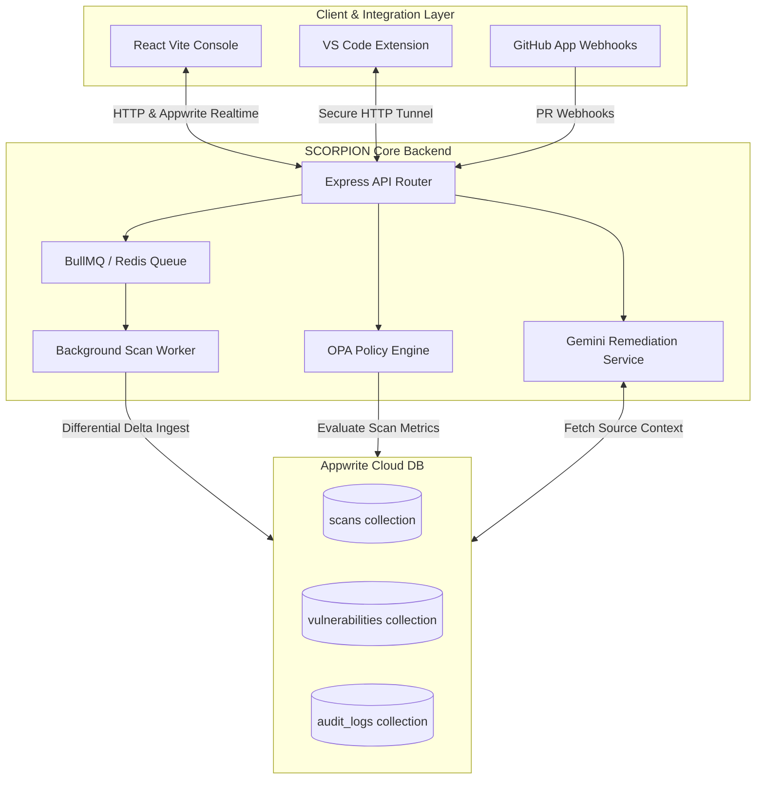
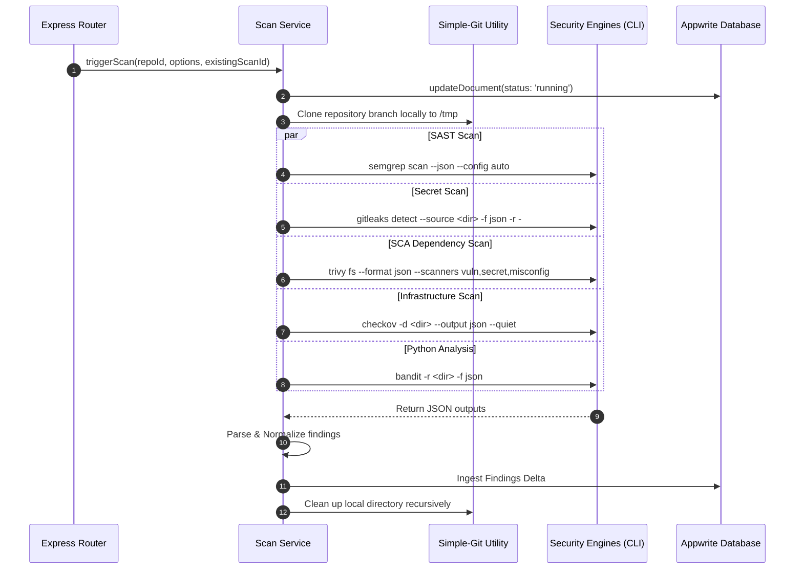
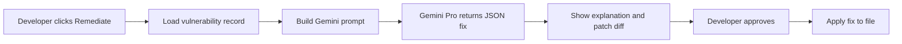
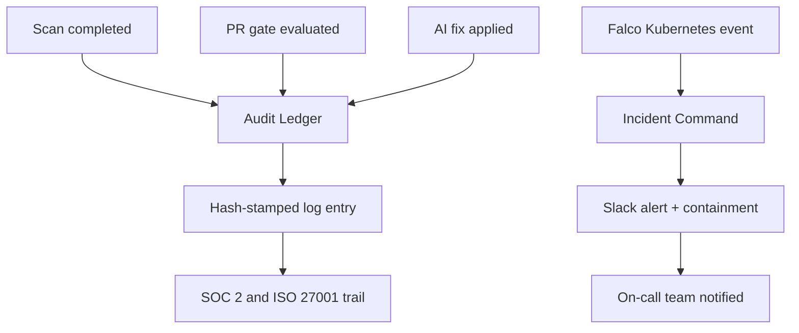
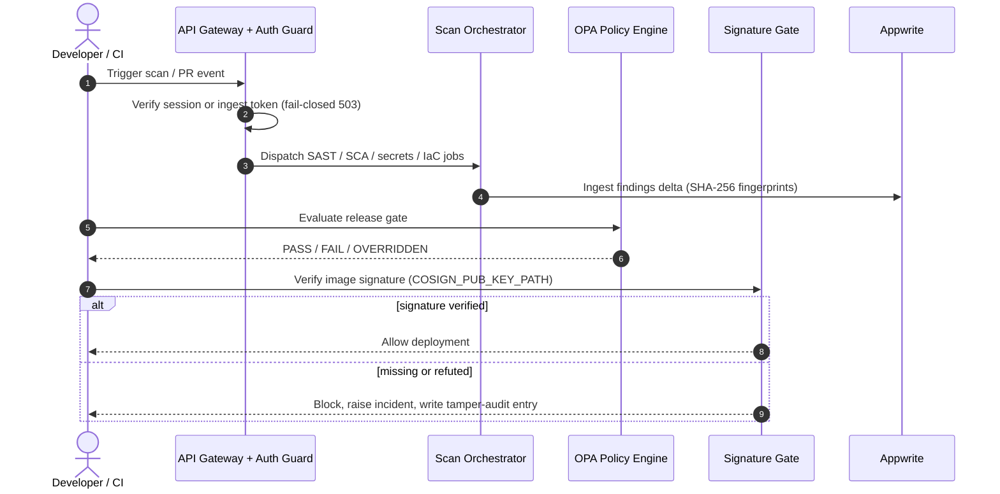

<div align="center">

# 🛡️ SCORPION

**Enterprise-Grade AI-Powered DevSecOps Orchestration Platform**

Unified multi-engine scanning · real-time threat telemetry · policy-driven CI/CD gates · AI-powered remediation

[](https://github.com/Manikantareddy941-hash/Scorpion/actions/workflows/ci.yml)
[](https://github.com/Manikantareddy941-hash/Scorpion/actions/workflows/stackpilot-scan.yml)


</div>

---

## Table of Contents

- [Overview](#overview)
- [Features](#features)
- [Architecture](#architecture)
- [Core Workflows](#core-workflows)
- [Tech Stack](#tech-stack)
- [Getting Started](#getting-started)
- [Security Hardening](#security-hardening)
- [Verification](#verification)
- [Project Structure](#project-structure)
- [Contributing](#contributing)

---

## Overview

SCORPION is a production-grade security control plane that protects applications across their entire lifecycle — from a developer's local VS Code sandbox, through GitHub pull requests, to production deployment runtimes. It unifies SAST, SCA, secrets, IaC, and DAST scanning behind one dashboard, gates releases with policy-as-code, and uses Gemini to generate drop-in remediation patches.

## Features

| Category | Capability |
|---|---|
| 🔍 **Scanning** | Parallel SAST (Semgrep), SCA (Trivy), secrets (Gitleaks), IaC (Checkov), Python (Bandit), DAST (OWASP ZAP, Nuclei, ffuf) |
| 🤖 **AI Remediation** | "TONY" engine — context-aware patch generation via Gemini, applied as reviewable diffs |
| 🚪 **Policy Gates** | OPA/Rego policy-as-code authored in a Policy Builder UI, enforced at both the GitHub PR commit-status gate and the Kubernetes deploy gate |
| 🏢 **Multi-Tenancy** | Team-scoped repos/scans/incidents, fine-grained IAM, Okta/Microsoft SSO via Appwrite OAuth2 |
| 🧵 **Async Pipeline** | Redis-backed BullMQ scan queue, decoupled from the request thread |
| 🧩 **Threat Modeling** | STRIDE threat modeling with Gemini AI threat generation, one-click convert to acceptance-criteria security stories in the backlog |
| 🔐 **Supply Chain** | cosign container image signing/verification, automated leaked-secret revocation |
| 🚨 **Incident Response** | Slack alerting, automated containment, Falco runtime event ingestion |
| 📋 **Compliance** | SOC 2 / ISO 27001 / HIPAA / GDPR control evaluation, hash-stamped audit ledger |
| 🧰 **Dev Integrations** | VS Code extension with inline diagnostics, GitHub App webhooks |

## Architecture

SCORPION is a decentralized, multi-tiered system: a React dashboard, an Express API gateway, a background worker fleet, and external integrations (GitHub App, VS Code extension), all synchronized through an Appwrite Cloud telemetry database.

Rendered inline below rather than as an exported image, so the diagram is
reviewable in a pull request diff and cannot drift from the system it describes
without someone editing it.


```mermaid
flowchart TD
    subgraph ClientTier [Client & Integration Layer]
        FE[React Vite Console]
        VSCode[VS Code Extension]
        GHApp[GitHub App Webhooks]
    end

    subgraph CoreBackend [SCORPION Core Backend]
        API[Express API Router]
        Queue[BullMQ / Redis Queue]
        Worker[Background Scan Worker]
        Policy[OPA Policy Engine]
        AI[Gemini Remediation Service]
    end

    subgraph Storage [Appwrite Cloud DB]
        ScansColl[(scans collection)]
        VulnsColl[(vulnerabilities collection)]
        AuditColl[(audit_logs collection)]
    end

    FE <-->|HTTP & Appwrite Realtime| API
    VSCode <-->|Secure HTTP Tunnel| API
    GHApp -->|PR Webhooks| API

    API --> Queue --> Worker
    API --> Policy
    API --> AI

    Worker -->|Differential Delta Ingest| Storage
    Policy -->|Evaluate Scan Metrics| Storage
    AI <-->|Fetch Source Context| Storage
```

## Core Workflows

<details>
<summary><b>1. Parallel Multi-Engine Scan Pipeline</b></summary>

Scan service clones the target repo and runs five scanners in parallel under a sandboxed environment, queued via BullMQ.

**Files:** [`backend/src/workers/scanWorker.ts`](backend/src/workers/scanWorker.ts) · [`backend/src/services/scanService.ts`](backend/src/services/scanService.ts)


```mermaid
sequenceDiagram
    autonumber
    participant Router as Express Router
    participant Service as Scan Service
    participant Git as Simple-Git Utility
    participant Tools as Security Engines (CLI)
    participant DB as Appwrite Database

    Router->>Service: triggerScan(repoId, options, existingScanId)
    Service->>DB: updateDocument(status: 'running')
    Service->>Git: Clone repository branch locally to /tmp
    par SAST Scan
        Service->>Tools: semgrep scan --json --config auto
    and Secret Scan
        Service->>Tools: gitleaks detect --source <dir> -f json -r -
    and SCA Dependency Scan
        Service->>Tools: trivy fs --format json --scanners vuln,secret,misconfig
    and Infrastructure Scan
        Service->>Tools: checkov -d <dir> --output json --quiet
    and Python Analysis
        Service->>Tools: bandit -r <dir> -f json
    end
    Tools-->>Service: Return JSON outputs
    Service->>Service: Parse & Normalize findings
    Service->>DB: Ingest Findings Delta
    Service->>Git: Clean up local directory recursively
```
</details>

<details>
<summary><b>2. Differential Delta Ingestion</b></summary>

SHA-256 fingerprints compare incoming findings against stored issues to avoid duplicate alerts and enable fast writes.

**File:** [`backend/src/services/scanService.ts#L22`](backend/src/services/scanService.ts) (`ingestVulnerabilitiesDelta`)


```mermaid
flowchart TD
    Start([Receive Incoming Vulnerabilities]) --> FetchDB[Fetch Open Vulnerabilities from DB]
    FetchDB --> HashDB[Compute SHA-256 signatures for DB docs]
    HashDB --> HashIncoming[Compute SHA-256 signatures for incoming items]
    HashIncoming --> DiffCheck{In Incoming but NOT in DB?}
    DiffCheck -- Yes --> CreateDoc[createDocument: status open]
    DiffCheck -- No --> ActiveCheck{In DB but MISSING from Incoming?}
    ActiveCheck -- Yes --> ResolveDoc[updateDocument: status resolved]
    ActiveCheck -- No --> Ignore[Keep status unchanged]
```
</details>

<details>
<summary><b>3. TONY: AI Remediation Engine</b></summary>

Generates context-aware drop-in patches and git-compliant diffs via Gemini Pro.

**Files:** [`backend/src/services/aiService.ts`](backend/src/services/aiService.ts) · [`backend/src/routes/remediate.ts`](backend/src/routes/remediate.ts)


```mermaid
flowchart LR
    DeveloperRemediate["Developer clicks Remediate"] --> LoadRecord["Load vulnerability record"]
    LoadRecord --> BuildPrompt["Build Gemini prompt"]
    BuildPrompt --> GeminiReturn["Gemini Pro returns JSON fix"]
    GeminiReturn --> ShowExpl["Show explanation and patch diff"]
    ShowExpl --> DevApprove["Developer approves"]
    DevApprove --> ApplyFix["Apply fix to file"]
```
</details>

<details>
<summary><b>4. GitHub PR Policy Enforcement Gate (OPA)</b></summary>

Checks repo vulnerabilities against OPA/Rego policy and posts results to GitHub commit status checks.

**Files:** [`backend/src/services/opaService.ts`](backend/src/services/opaService.ts) · [`backend/src/services/policyService.ts`](backend/src/services/policyService.ts) · [`backend/src/github/policyEngine.ts`](backend/src/github/policyEngine.ts)


```mermaid
flowchart TD
    ScanEnd([Scan Process Completed]) --> PullScan[Retrieve Scan severity counts]
    PullScan --> CheckRule{OPA policy evaluation}
    CheckRule -- Passed --> PassState[Gate Status: PASSED]
    CheckRule -- Violated --> FailState[Gate Status: BLOCKED]
    PassState --> PostPass[Post GitHub PR Commit Status: success]
    FailState --> PostFail[Post GitHub PR Commit Status: failure]
    PostPass --> MergeOK([Allow Pull Request Merge])
    PostFail --> MergeBlocked([Block Pull Request Merge])
```
</details>

<details>
<summary><b>5. VS Code Extension Workspace Loop</b></summary>

Embeds SCORPION intelligence directly into the local dev environment.

**Files:** [`scorpion-vscode/src/diagnosticProvider.ts`](scorpion-vscode/src/diagnosticProvider.ts) · [`scorpion-vscode/src/sidebarProvider.ts`](scorpion-vscode/src/sidebarProvider.ts)


```mermaid
flowchart TD
    VSActivate([Activate Extension]) --> Connect[Initialize scorpionClient]
    Connect --> Watch[Watch open workspace text files]
    Watch --> FetchVulns[HTTP Fetch vulnerabilities for current file]
    FetchVulns --> SetSquiggles[Draw Diagnostic Squiggles on error lines]
    Watch --> SidebarPanel[Render Webview Sidebar showing metrics]
    SetSquiggles --> RemediateCmd[Trigger scorpion.remediate on code action]
    RemediateCmd --> DiffView[Show side-by-side split code review and apply]
```
</details>

<details>
<summary><b>6. Multi-Tenancy, Threat Modeling & Incident Response</b></summary>

Repos/scans/incidents/compliance are team-scoped (closing cross-tenant IDOR); STRIDE threat modeling generates threats with Gemini AI and converts them into acceptance-criteria security stories; critical incidents trigger Slack alerts and automated containment, feeding the hash-stamped Audit Ledger.

**Files:** [`backend/src/services/tenancyService.ts`](backend/src/services/tenancyService.ts) · [`backend/src/services/threatModelService.ts`](backend/src/services/threatModelService.ts) · [`backend/src/services/slackService.ts`](backend/src/services/slackService.ts) · [`src/pages/AuditLedger.tsx`](src/pages/AuditLedger.tsx)


```mermaid
flowchart TD
    ScanCompleted["Scan completed"] --> AuditLedger["Audit Ledger"]
    PRGate["PR gate evaluated"] --> AuditLedger
    AIFix["AI fix applied"] --> AuditLedger
    AuditLedger --> HashStamped["Hash-stamped log entry"]
    HashStamped --> SOCTrail["SOC 2 and ISO 27001 trail"]

    FalcoEvent["Falco Kubernetes event"] --> IncidentCommand["Incident Command"]
    IncidentCommand --> SlackAlert["Slack alert + containment"]
    SlackAlert --> OnCallTeam["On-call team notified"]
```
</details>

## Tech Stack

<table>
<tr><td valign="top">

**Frontend**
- React `19` · Vite `8` · TypeScript `6`
- Tailwind CSS · Lucide React
- Appwrite SDK (realtime)
- Recharts · amCharts 5 · React Markdown · React Flow
- `@google/generative-ai`

</td><td valign="top">

**Backend**
- Express · TypeScript `6` · Node.js `24`
- BullMQ + ioredis · Prisma (Postgres / SQLite adapters)
- Octokit / `@octokit/auth-app` · simple-git · dockerode
- zod · helmet · express-rate-limit · bcrypt · jsonwebtoken
- Resend (email) · pdfkit · json2csv · archiver
- winston + winston-loki · prom-client · OpenTelemetry
- cosign CLI · OPA (Rego)

</td></tr>
</table>

## Getting Started

### Prerequisites

```bash
# Installs Semgrep, Trivy, Gitleaks, Checkov, Bandit
npm run install
```

### 1. Configure environment

Create `backend/.env`:

```env
APPWRITE_ENDPOINT=https://cloud.appwrite.io/v1
APPWRITE_PROJECT_ID=your_project_id
APPWRITE_API_KEY=your_appwrite_api_key
APPWRITE_DATABASE_ID=scorpion_db
GEMINI_API_KEY=your_gemini_generative_key
GITHUB_APP_ID=your_github_app_id
GITHUB_PRIVATE_KEY=your_github_pem_key
```

### 2. Run the backend

```bash
cd backend
npm install
npm run dev
```

### 3. Run the UI

```bash
npm install
npm run dev
```

### 4. Run the VS Code extension

```bash
cd scorpion-vscode
npm install
# Press F5 in VS Code to launch in debug extension mode
```

## Security Hardening

- **No shell interpolation** — every subprocess spawn goes through `execFile` with an argv array (20 modules), so no shell is ever invoked and there is nothing to inject into.
- **Outbound SSRF** — `assertSafeWebhookUrl` guards both alert webhooks and the Jira integration's user-supplied `baseUrl`, checked inside the request helper rather than at configuration time because the config is mutable at runtime.
- **Telemetry ingestion** — `/api/metrics` and `/api/logs` require either an ingest token or a session, and in both cases the repository is checked against the identity the *credential* carries, never the `repoId` in the request body. Fails closed with 503 if the access check itself errors.
- **Tenant isolation** — repos, scans, vulnerabilities, builds, deployments, incidents, compliance, and policy entities are team-scoped; IDOR closed across multiple hardening passes.
- **Auth & secrets** — the dev-auth bypass is opt-in (`ALLOW_DEV_AUTH_BYPASS`, refused in production), `RESET_TOKEN_SECRET` fails fast if unset in prod, webhook secrets never logged, leaked API keys auto-revoked at source.
- **Email verification** — soft enforcement: the dashboard stays open, but CI token creation, team invites, alert integrations and report export require a verified address and answer `403 { code: 'EMAIL_VERIFICATION_REQUIRED' }`. Soft rather than hard because a self-hosted install with no SMTP cannot produce a verified user at all.
- **Execution isolation** — `RUNNER_MODE=kubernetes` runs scanners as ephemeral Jobs under `--network none`. It is the only isolated mode and is never auto-selected, so every boot emits `RUNNER_MODE_SELECTED` with an `isolated` field to make the fallback alertable. See [OPERATIONS_RUNBOOK.md](./OPERATIONS_RUNBOOK.md).
- **Request hardening** — baseline + endpoint-specific rate limiting, correct `trust proxy`, HSTS, structured auth logging, Zod validation on high-risk writes.
- **Upload & SSRF defense** — uploads validated by content (not extension) with zip-bomb guards; outbound webhook URLs checked against SSRF.
- **Supply chain** — container images signed/verified with cosign; release gates evaluated via OPA/Rego instead of hardcoded thresholds.
- **Tamper-proof audit trail** — deterministic cryptographic hashing on all scanner inputs feeding the Audit Ledger.

### Release gate flow


```mermaid
sequenceDiagram
    autonumber
    actor Dev as Developer / CI
    participant Gate as API Gateway + Auth Guard
    participant Scanner as Scan Orchestrator
    participant OPA as OPA Policy Engine
    participant Cosign as Signature Gate
    participant DB as Appwrite

    Dev->>Gate: Trigger scan / PR event
    Gate->>Gate: Verify session or ingest token (fail-closed 503)
    Gate->>Scanner: Dispatch SAST / SCA / secrets / IaC jobs
    Scanner->>DB: Ingest findings delta (SHA-256 fingerprints)

    Dev->>OPA: Evaluate release gate
    OPA-->>Dev: PASS / FAIL / OVERRIDDEN

    Dev->>Cosign: Verify image signature (COSIGN_PUB_KEY_PATH)
    alt signature verified
        Cosign-->>Dev: Allow deployment
    else missing or refuted
        Cosign-->>Dev: Block, raise incident, write tamper-audit entry
    end
```

> The signature gate is inert unless `REQUIRE_IMAGE_SIGNATURE` **and**
> `COSIGN_PUB_KEY_PATH` are both configured — and enabling the former without the
> latter blocks every production deploy. The ordering is documented in
> [OPERATIONS_RUNBOOK.md](./OPERATIONS_RUNBOOK.md); `probeSigningReadiness` catches
> the mistake at boot rather than mid-release.

## Verification

```bash
cd backend && npm test          # 187 suites, 1763 passing, 98 skipped
cd backend && npx tsc --noEmit
npm test                        # frontend: 7 files, 51 tests
npm run typecheck
```

The 12 skipped backend suites are database integration tests, gated behind
`RUN_DB_IT` plus Docker. Skipping is by design, not a gap.

CI enforces four bounded gates beyond the test suites:

| Gate | Value | Direction |
|---|---|---|
| `auditLoggerCalls.js` | `--max=0` | Regression guard — convert the call site, never raise the number |
| `auditResponseErrorLeaks.js` | `--max=31 --min=31` | **Bounded both ways.** The floor is deliberate: 19 authorization and 12 validation messages the caller is entitled to. Sweeping it to zero breaks clients while making a security tool report success |
| backend ESLint | `--max-warnings=168` | Ratchet, lowers only |
| frontend ESLint | `--max-warnings=23` | Ratchet, zero headroom |
| `npm audit --omit=dev` | `--audit-level=high` | Zero tolerance on both trees |

## Project Structure

```
Scorpion/
├── backend/            Express API, workers, scanners, services
├── src/                React dashboard (Vite + TypeScript)
├── scorpion-vscode/    VS Code extension
├── functions/          Appwrite serverless functions (e.g. trivy-scanner)
├── public/             Architecture diagrams, static assets
├── docs/               Additional documentation
└── scripts/            Tooling install scripts
```

## Contributing

Issues and PRs welcome. Run `npm run lint && npm run typecheck && npm test` before submitting.
